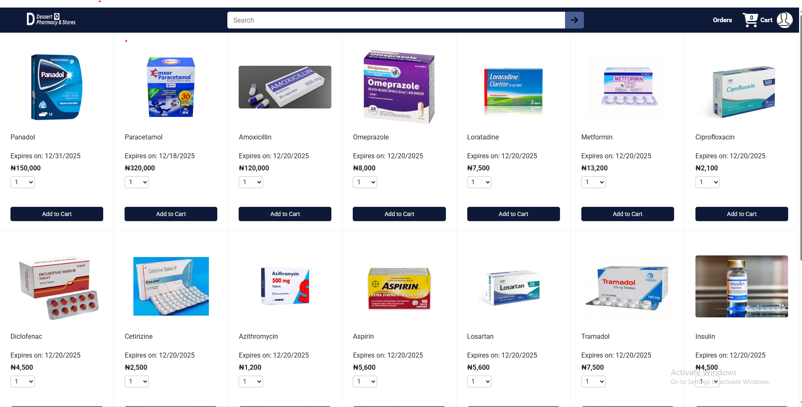
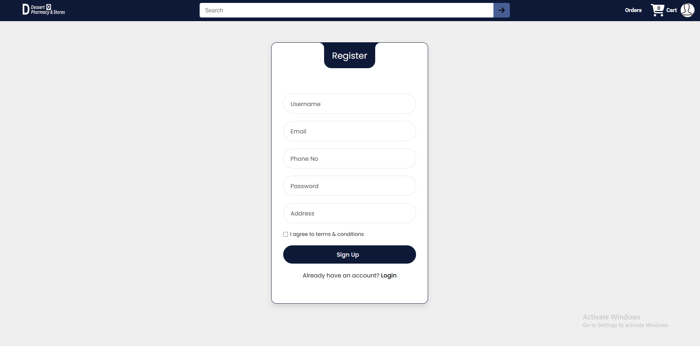
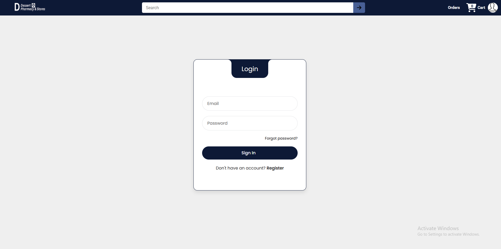
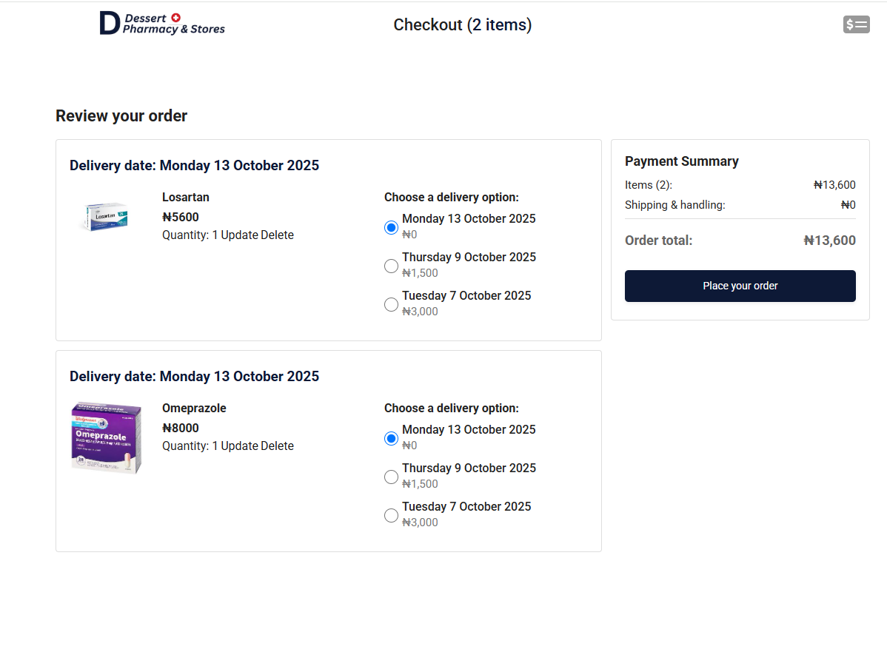
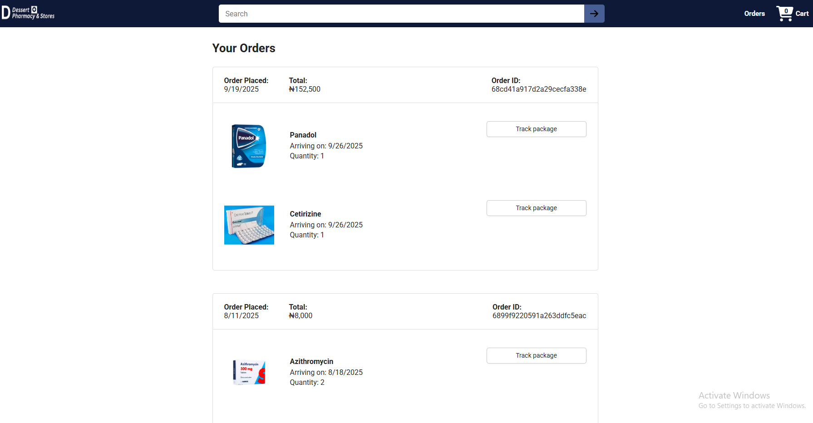
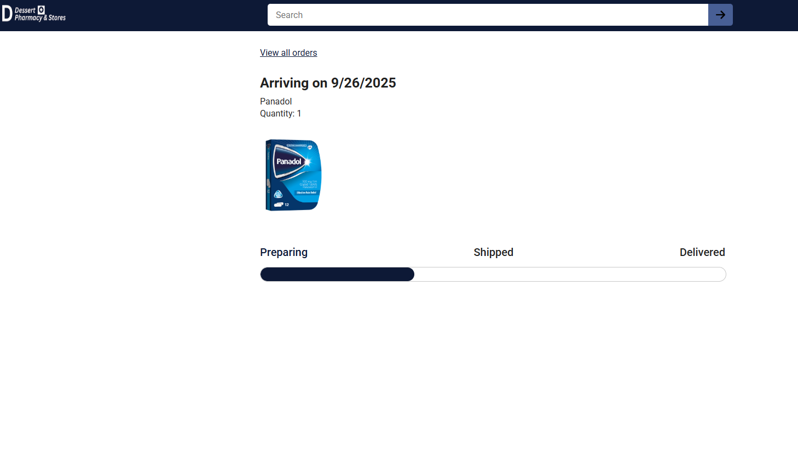

# 💊 Online Pharmacy Shop

Online Pharmacy is a full-stack web application designed to make buying drugs and medical supplies easy and accessible just like a modern e-commerce platform.

Users can browse available medicines on the Home Page, create an account through the Register Page, and securely sign in using the Login Page. After logging in, they can add products to their Cart, place Orders, and track them through the Delivery Status Page.

The system provides a smooth user experience with real-time updates, secure authentication, and a clean interface for managing all pharmacy purchases online.

This project contains both the frontend and backend of an Online Pharmacy system.

pharmacy/
 ├── Online-Pharmacy-Shop/       # Frontend (React + Vite)
 │   ├── public/
 │   ├── src/
 │   │   ├── assets/
 │   │   ├── components/
 │   │   ├── pages/
 │   │   ├── App.jsx
 │   │   ├── main.jsx
 │   │   ├── app.css
 │   │   └── index.css
 │   ├── package.json
 │   ├── vite.config.js
 │   └── README.md
 │
 └── Online-pharmacy-backend/    # Backend (Node.js + Express + MongoDB)
     ├── config/
     ├── controllers/
     ├── middlewares/
     ├── models/
     ├── routes/
     ├── uploads/
     ├── .env                    # Environment variables (not committed)
     ├── package.json
     └── server.js (or app.js)

⚙️ Features

🧾 User registration and login (JWT authentication)

🛍️ Product listing, details, and management

🧠 Role-based access (Admin & User)

🧺 Cart and order handling

☁️ Cloud image storage via Cloudinary

🧩 MongoDB Atlas integration for online database

🛡️ Middleware for validation and authentication

🚀 Tech Stack
Frontend

React (Vite)

React Router

Axios

CSS

Backend

Node.js + Express.js

MongoDB Atlas (via Mongoose)

Cloudinary (for image uploads)

JWT for authentication

Multer, bcrypt, dotenv

1️⃣ Clone the repository

git clone https://github.com/yourusername/pharmacy.git
cd pharmacy

2️⃣ Backend Setup

cd Online-pharmacy-backend
npm install

🔐 Create a .env file in the backend folder:
PORT=3000
MONGODB_PASSWORD=your_mongodb_password
CLOUD_NAME=your_cloudinary_cloud_name
CLOUD_API_KEY=your_cloudinary_api_key
JWT_SECRET=your_jwt_secret_key

💡 Note:
Go to MongoDB Atlas and create an account.
Get your connection password and configure it in your .env.
Go to Cloudinary and register to get your cloud name and API key.

Run the backend:
node server.js

3️⃣ Frontend Setup

cd ../Online-Pharmacy-Shop
npm install
npm run dev
Then open the local URL printed in your terminal (e.g., http://localhost:5173).

---

## 🖼️ Website Pages Preview

Below are some screenshots showing the main pages of the Online Pharmacy website.
| Page  Screenshot 

 🏠 Home Page  
 | 🧍‍♂️ Register Page |  |
| 🔐 Login Page |  |
| 🛒 Cart Items Page |  |
| 📦 Orders Page |  |
| 🚚 Delivery Status Page |  |

